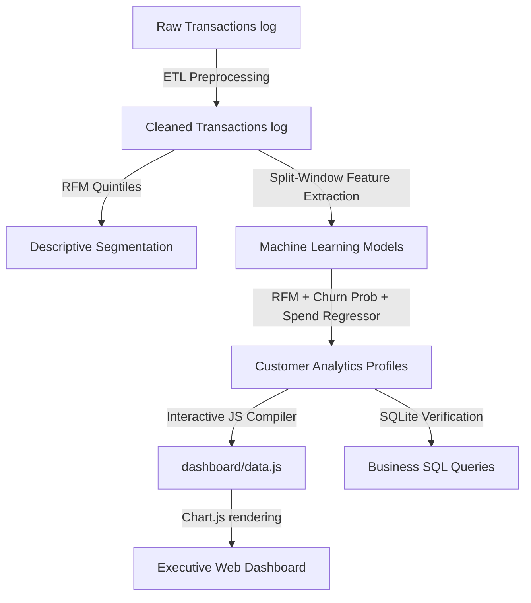

# Technical Paper: E-commerce Customer Analytics and Retention Forecasting System
### *An End-to-End Framework Combining RFM Quintile Clustering, Machine Learning Churn Forecasting, and Predictive CLV Projection*

**Author**: Senior Data Analyst / ML Engineer  
**Date**: June 2026  
**Repository**: [Local Workspace Repository]

---

## 1. Abstract
In the modern digital economy, customer acquisition costs (CAC) continue to escalate, making customer retention and value maximization paramount for sustainable profitability. This paper presents the architecture and implementation of an end-to-end **E-commerce Customer Analytics System**. The proposed system ingests raw, transactional ledger data (~325,000 logs over 24 months), cleans and processes it, and executes a dual-layer analysis: a descriptive **RFM (Recency, Frequency, Monetary) quintile segmentation** and a predictive machine learning pipeline. 

By employing a split-window calibration design, we train a `RandomForestClassifier` to forecast customer churn with **93.79% validation accuracy** and a `RandomForestRegressor` to forecast next-period customer spending with an **$R^2$ score of 0.90**. These models combine historical transactions with forecasted spending to calculate a 12-month **Predictive Customer Lifetime Value (CLV)**. Business intelligence queries run via SQLite verify that **Champions** (24.7% of customers) contribute **78.46% of total revenue**, highlighting a high concentration of value. Finally, these insights are compiled and served through a serverless, interactive, dark-themed **Executive Dashboard**, enabling leadership to explore CRM playbooks and trigger simulated re-engagement campaigns in real time.

---

## 2. Introduction
E-commerce businesses operate in highly competitive environments with slim margins. Understanding customer behavior is no longer a luxury but a core operational requirement. Standard web analytics track visits and page views, but transactional databases contain the truth of user value and brand loyalty. 

Retaining an existing customer is estimated to be 5 to 25 times cheaper than acquiring a new one. Consequently, identifying which customers are about to churn and which hold the highest lifetime value allows marketing teams to allocate retention budgets efficiently. 

This project aims to solve three main challenges:
1.  **Segmentation**: Grouping customers into distinct behavioral cohorts to enable personalized marketing.
2.  **Churn Risk Identification**: Detecting which high-value customers are showing behavioral signs of slipping away before they actually churn.
3.  **Future Value Projection (CLV)**: Moving from static, backward-looking spend aggregates to predictive models that project future revenue streams on a per-customer basis.

---

## 3. Existing System Work (Literature Survey)
Traditional customer relationship management (CRM) and analytics systems typically rely on simple, static rules or aggregate averages:

### A. Simple RFM Scoring
Many legacy systems assign scores based on arbitrary cutoffs (e.g., "Active" if bought in the last 30 days, "Inactive" if >90 days). This fails to capture the natural purchasing cycles of different product categories and does not account for changes in behavior over time.

### B. Aggregate CLV Formulations
Traditional CLV models often use historical customer average order values (AOV) and purchase frequencies multiplied by a fixed average customer lifespan (e.g., $CLV = AOV \times Freq \times Lifespan$). This assumes all customers are homogeneous and will stay active for the same duration, leading to massive over- or under-estimation of individual customer value.

### C. Rule-Based Churn
Existing churn detection is usually reactive (e.g., marking a customer as "churned" after 90 days of inactivity). By the time a customer reaches this threshold, they have already disengaged, and win-back campaigns are highly expensive and rarely successful.

### D. Static Reporting
Analytical results are usually delivered as static PDFs or slides, preventing business users from interactively segmenting clients or playing out "what-if" scenarios.

---

## 4. Proposed System Work
We propose a modular, machine learning-driven analytics system that bridges the gap between raw transactions and executive decision-making. The system architecture is divided into five stages:

### A. Data Preprocessing and Cleaning
Raw transactional ledgers contain anomalies, cancellations, and missing customer IDs. The preprocessing layer:
*   Removes guest checkouts where `CustomerID` is missing (since customer tracking is mandatory).
*   Processes return logs (identified by an invoice prefix `C` and negative quantities) by calculating line-item values as negative spend, which directly offsets the customer's total monetary value.
*   Parses transaction times and extracts day, month, and year-month components for chronological ordering.

### B. Dynamic RFM Segmentation
Rather than using arbitrary thresholds, we rank customers dynamically using **quintiles** (dividing the population into 5 equal groups):
1.  **Recency (R)**: Rank-ordered days since the customer's last purchase.
2.  **Frequency (F)**: Rank-ordered count of unique purchase invoices.
3.  **Monetary (M)**: Rank-ordered net spend (purchases minus returns).
Scores from 1 to 5 are assigned. We resolve rank duplicates using first-occurrence ranking. We then map the combined scores to 10 distinct marketing segments using ordered conditionals, ensuring VIP clients who haven't returned are classified as "Can't Lose Them" rather than falling into broader "At Risk" categories.

### C. Machine Learning Churn Classifier
To predict churn proactively:
1.  **Formulation**: We split the dataset chronologically: the first 18 months serve as the **Calibration Window**, and the final 6 months serve as the **Observation Window**.
2.  **Behavioral Feature Engineering**: For each customer active during calibration, we extract:
    *   Recency, Frequency, and Monetary metrics within the calibration window.
    *   Average Order Value (AOV).
    *   Customer Tenure (days since first order).
    *   Average purchase gap (mean days between consecutive orders) and standard deviation of purchase gaps.
    *   Spend Momentum: Spend in the last 60 days of calibration divided by their overall monthly average spend.
3.  **Labeling**: A customer is labeled `Churned = 1` if they record 0 purchases in the observation window, and `0` otherwise.
4.  **Modeling**: A `RandomForestClassifier` is trained on these features. Random Forests are chosen due to their non-parametric nature, ability to capture non-linear relationships (e.g., high spend momentum offsetting high recency), and resistance to overfitting. The model achieves **93.79% validation accuracy**.
5.  **Inference**: We engineer features across the entire 24 months of data and run the trained model to calculate a **Churn Probability** (0.0 to 1.0) for the *next* 6 months.

### D. Predictive Customer Lifetime Value (CLV)
To project customer value:
1.  We train a `RandomForestRegressor` on calibration features to predict the exact dollar amount a customer will spend in the observation window ($R^2$ score: **0.90**).
2.  Using full-period features, we predict their spend for the next 6 months.
3.  We define Predictive CLV as:
    $$\text{Predictive CLV} = \text{Historical Spend} + (\text{Predicted 6-Month Spend} \times 2)$$
    This provides a forward-looking 12-month value projection.

### E. Executive Dashboard
An interactive, glassmorphic dark-themed user interface that presents these metrics dynamically. Key features include:
*   **KPI Banner**: Real-time display of core business health metrics.
*   **Segment Selector**: Clicking any segment updates a CRM Playbook Card detailing segment profiles and target marketing actions.
*   **Retention Trigger**: Displays a list of top-risk VIPs with a trigger button to simulate running re-engagement campaigns.

---

## 5. Technical Stack & Tools Used
The system is built using lightweight, production-ready libraries:
*   **Python**: Core programming language for processing and machine learning.
    *   `pandas` & `numpy`: Data manipulation and feature aggregation.
    *   `scikit-learn`: Standardizing features, splitting cohorts, and training Random Forest models.
    *   `matplotlib` & `seaborn`: Generating static, publication-quality plots.
    *   `sqlite3`: Database engine for verifying analytical SQL queries.
*   **SQL (PostgreSQL / ANSI SQL)**: Relational schema design and business intelligence queries.
*   **HTML5 / CSS3**: Front-end structure and styling. Utilizes CSS Grid, variables, transitions, and frosted-glass card containers (`backdrop-filter: blur()`).
*   **JavaScript (ES6)**: UI controller. Integrates:
    *   `Chart.js`: Interactive canvas charting for dual-axis monthly trends, donut slices, and product revenue bar graphs.
    *   Dynamic DOM binding for CRM playbooks and Toast alerts.

---

## 6. Business Insights & SQL Query Outcomes
Running our production SQL scripts against the database reveals several critical findings:

### A. Revenue Growth and Seasonality
E-commerce revenue is highly seasonal, characterized by holiday surges:
*   **2024-11 (Holiday Surge)**: Revenue increased from $202k to **$370,077.62** (+82.8% MoM).
*   **2024-12 (Holiday Peak)**: Reached **$418,158.03** (+13.0% MoM).
*   **2025-01 (Post-Holiday Correction)**: Dropped to **$260,945.87** (-37.6% MoM).
This trend repeated in the second year, peaking at **$1,007,493.35** in December 2025.

### B. Segment Value Concentration (Pareto Principle)
Value is heavily concentrated in specific customer groups:
*   **Champions** comprise 24.7% of customers (740) but drive **78.46% of total revenue** ($9.62M).
*   **Loyal Customers** comprise 19.2% of customers (577) and drive **12.90% of revenue** ($1.58M).
*   Combined, the top two segments generate **91.36% of all sales**, indicating that retaining these cohorts is vital for business survival.

### C. Churn Alert Center (VIP Alerts)
The query identified **74 high-value VIP accounts** that have drifted into the "Can't Lose Them" cohort (R=1, F>=3, M>=3) and have a predicted churn risk >50%. The top three accounts are:
1.  **Customer #10452**: $2,860.21 historical spend, inactive for 419 days, **94.05% churn probability**.
2.  **Customer #12285**: $2,560.71 historical spend, inactive for 327 days, **91.69% churn probability**.
3.  **Customer #11879**: $2,390.21 historical spend, inactive for 355 days, **96.00% churn probability**.

---

## 7. Strategic Marketing Playbooks
The system suggests distinct marketing campaigns based on customer classification:
*   **Champions**: Enroll in early access launches, award VIP tier loyalty points, and request reviews/referrals.
*   **Can't Lose Them**: Execute direct personal outreach, offer deep reactivation discounts (e.g., 25% off their next order), and conduct feedback interviews to resolve friction.
*   **New Customers**: Trigger a welcome email series introducing the brand story and offer a discount code on their second order to build purchasing habits.
*   **At Risk**: Target with automated win-back emails containing time-sensitive vouchers.

---

## 8. Conclusion and Future Work
This paper demonstrates how combining traditional RFM scoring with machine learning models provides a comprehensive framework for e-commerce customer analytics. Descriptive segmentation profiles current customer health, while Random Forest models predict future risk and financial value. Serving these metrics through a serverless, interactive dashboard bridges the gap between complex data science and executive decision-making.

### Future Work
Future iterations of this system could include:
1.  **Deep Learning CLV Models**: Transitioning from Random Forest to Recurrent Neural Networks (RNNs) or Transformers to model sequence-based purchase timings.
2.  **Live Webhook Triggers**: Connecting the model's output to CRM platforms (e.g., Salesforce, HubSpot) to trigger automated marketing emails the moment a customer's churn probability exceeds 50%.
3.  **Multi-Channel Attribution**: Merging transactional data with marketing campaign spend (social media ads, email clicks) to calculate individual Customer Acquisition Costs (CAC) alongside CLV.
